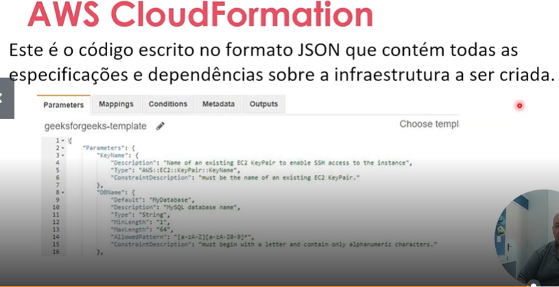
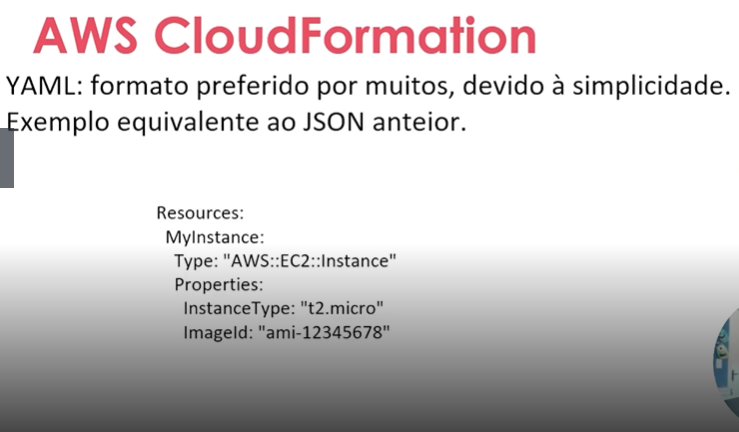

# Implementando-Infraestrutura-Automatizada-com-AWS-CloudFormation

## Benefícios do AWS CloudFormation

-*Automação:* O AWS CloudFormation ajuda a automatizar o processo de criaçaõ, configuração e gerenciamento de recursos da AWS. Isso permite que a infraestrutura seja implantada de forma rápida, confiável e rpetida.

-*Consistência e pedronização:* Com o AWS CloudFormation, é possível criar modelos padrão de pilhas de infraestrutura que podem ser usados para criar cópias idênticas da mesma infraestrutura. Isso garante consistência na implementação da infraestrutura e facilita a manutenção.

-*Economia de custos:* O AWS CloudFormation ajuda a reduzir custos permitindo que os  cleintes usem modelos de infraestrutura existentes e os reutilizem vários ambientes. Isso reduz o custo de projetar e implementar uma nova infraestrutura.

-*Segurança:* O AWS CloudFormation ajuda a garantir que todos os recursos da AWS seja configurados com segurança usando políticas e regras de segurança. Isso ajuda a proteger a infraestrutura de potenciais ameaças à segurança.

## Formatos para criação de modelos
 O AWS CloudFormation suporta JSON e YAML como formato para a criaçaõ de seus modelos(Templantes).

⚔️ ## Comparativo: AWS CloudFormation vs Terraform
Característica	AWS CloudFormation	Terraform
🌐 Compatibilidade	Exclusivo para recursos da AWS	Multi-cloud: AWS, Azure, GCP, e até on-premise
📝 Linguagem de definição	JSON ou YAML	HCL (HashiCorp Configuration Language), mais legível e intuitivo
📦 Gerenciamento de estado	Gerenciado automaticamente pela AWS	Requer backend para armazenar o estado (ex: S3, Terraform Cloud)
🔄 Reutilização de código	Suporte limitado a módulos e reutilização	Forte suporte a módulos e reutilização de configurações
🧩 Extensibilidade	Limitado ao ecossistema AWS	Pode usar providers para diversos serviços e plataformas
🛠️ Ferramentas de terceiros	Integração mais restrita	Ampla comunidade e integração com diversas ferramentas DevOps
🚀 Curva de aprendizado	Mais simples para quem já está imerso no AWS	Pode exigir mais aprendizado, mas oferece maior flexibilidade
💡 ## Quando usar cada um?
CloudFormation é ideal se você está 100% dentro do ecossistema AWS e quer aproveitar a integração nativa e segurança gerenciada.

Terraform é a escolha certa se você precisa de flexibilidade multi-cloud, quer reutilizar configurações ou integrar com ferramentas externas.

